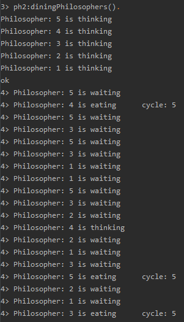

# Dining philosophers in Erlang

## How to run it
At first I spent some time to even run Erlang application, I'm using IntelliJ IDEA as great IDE, but not fully compatible with Erlang (in theory it is, in practice well ...),so I thought I can shortly write it here how to run Erlang there:
* [configure Erlang in IntelliJ](https://www.jetbrains.com/help/idea/getting-started-with-erlang.html)
* click: Run -> Run... -> Edit configuration -> *+* (top left) -> erlang console -> make sure you have SDK set, I also recommend in 'Before launch' field add 'Build' option -> apply / run
* below erlang console should start, check if you are in right directory: write *pwd().* <- don't forget the dot! never!
* if you are not in the directory where you have files with modules, write: *cd(name_of_dir).* e.g.: *cd(src).*
* compile, write: *c(name_of_dir)." e.g.: *c(ph1).* - do it with each module,
* run function - write in console: *module_name:function_name(args).* e.g.: *ph2:diningPhilosophers().* - now you know why module names are so short ;)

## If you ran it

Here we also have **Binary Exponential Backoff**, being realized by *checkFork* function, we have 3 modules listed below, and a bunch of sending messages between processes - as it is in Erlang, all works fast and great.

## ph1
Ok, I lied, not all works fast and great, this one stops (guess why, if you don't know read README.md in Node.js directory).

## ph2
Four lines of code and it works - so simple.

## ph3
And here we have our waiter (all is nicely described in Node.js directory, here is the same).

# Output format

  

