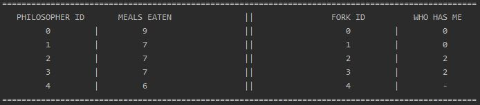
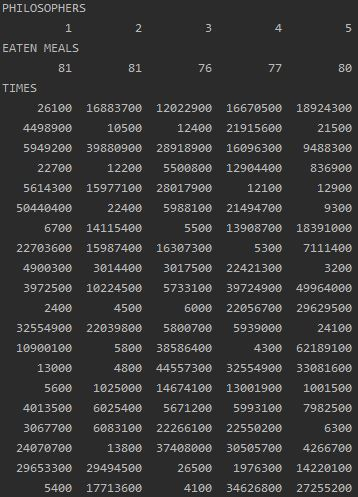

# Dining philosophers in Java

## Naive philosopher
The simplest one, with possibility of deadlock (which will probably happen fast). 

## Hungry or fat philosopher
This one is smarter and checks if both forks are available before taking them. Here deadlock is impossible, unfortunately we can starve part of philosophers, if one of their neighbours will be faster and will take fork first each time, 

## Philosopher with waiter
Finally, we have one smart guy (the waiter), which will look after philosophers and will allow to eat all but one. In this case always at least one philosopher will eat (guy next to the one stopped by waiter), we have no deadlock, we have no starvation, but each philosopher must wait a while.

# Output format
Available are two formats:

## Normal
One philosopher in one row, I think no comment needed.

  

## Test
One philosopher in one column, this numbers are times in ns showing how long must have he waited to get two forks and start eating.

  

