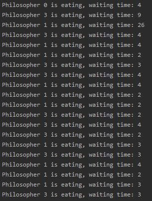

# Dining philosophers in Node.js

We have three functions:
* philosopher.startNaive(meals);
* philosopher.startAsym(meals);
* philosopher.startConductor(meals, waiter);

In each case philosopher eats *meals* meals one by one and ends. Time of eating is between 0 and 100 ms. In this scenario **Binary Exponential Backoff** algorithm is applied when philosopher wants to take taken fork (he will wait between 0 and 2^K ms, where K is number of conflict, still better option than stealing). 

## Start naive
Philosopher takes left fork and wait for the right one, enjoying *Binary Exponential Backoff*.

## Start asym
Philosophers thought for a moment (probably enjoying above method and starving) and made a plan: what if philosopher with even id number took first left than right fork and with odd id number took first right than left fork. Simple, pretty and working. Just philosopher with better reflex wins, but who told it must be fair.

## Start conductor
Ok, it should be fair and we have a guy for that: conductor. He will give permission to take forks or not, just that.

# Output format

  

